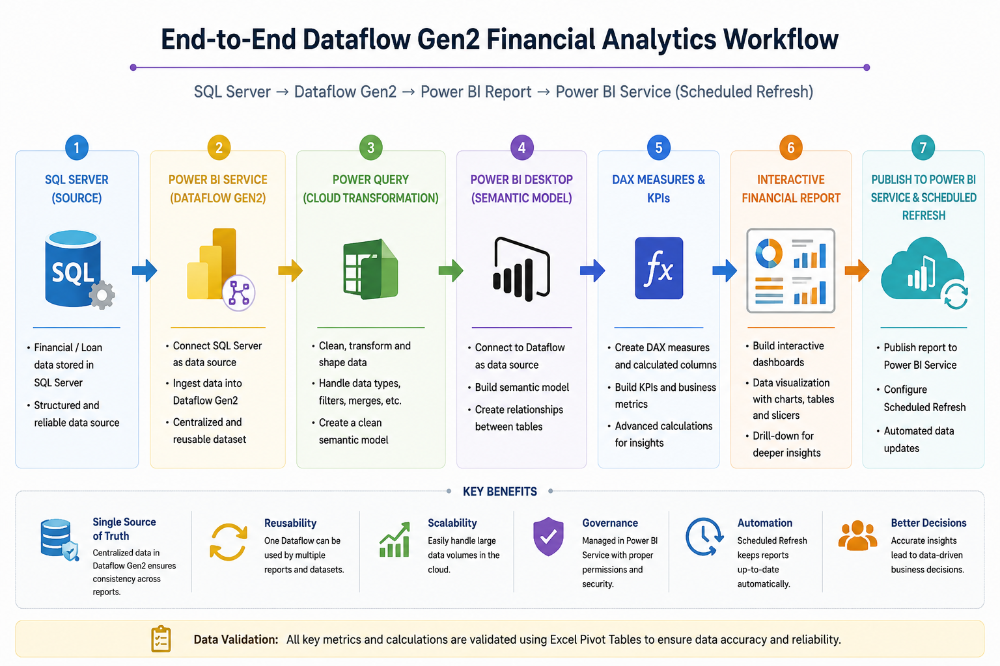
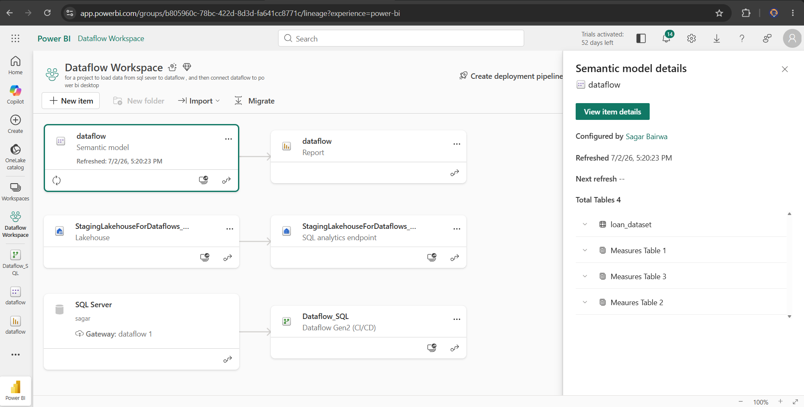
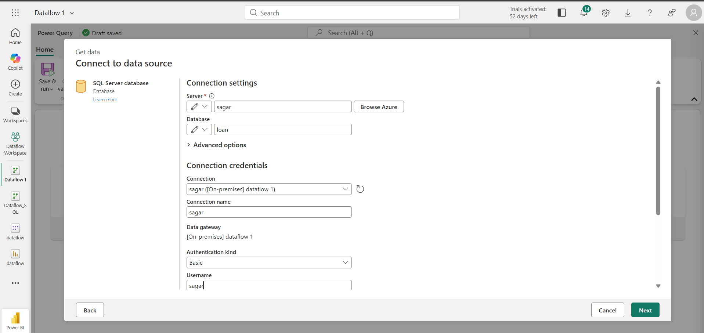
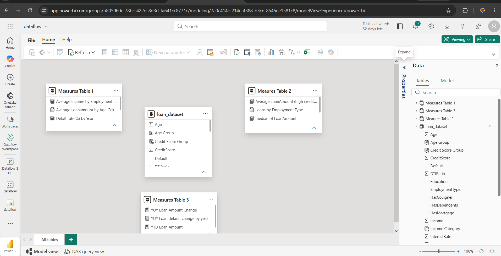
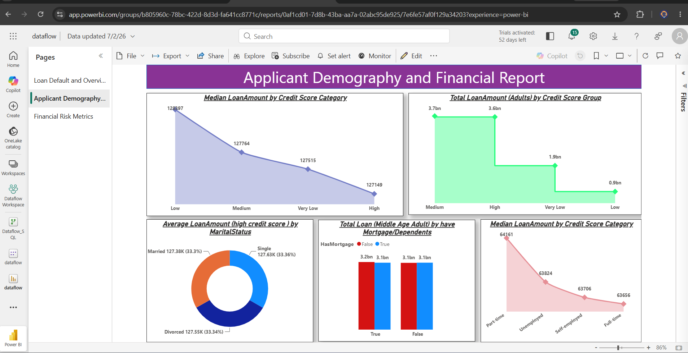

# End-to-End Dataflow Financial Analytics | Power BI Service

An enterprise-style Business Intelligence project demonstrating how **SQL Server**, **Power BI Dataflow Gen2**, **Power Query**, **DAX**, and **Power BI Service** work together to build a centralized cloud-based reporting solution.

The project showcases a modern reporting architecture where data is ingested into **Power BI Dataflow Gen2**, transformed in the cloud, modeled using DAX, and deployed with automated scheduled refresh.

---

## 🛠️ Tech Stack

<p align="left">


</p>

---

# Project Workflow



---

# Project Overview

This project demonstrates how organizations centralize data preparation using **Power BI Dataflow Gen2** instead of connecting every report directly to operational databases.

A reusable Dataflow serves as the single source of truth for reporting, while Power BI Desktop is used to build semantic models, DAX calculations, and interactive dashboards before deployment to Power BI Service.

---

# Business Problem

Many organizations maintain multiple Power BI reports connected directly to SQL databases.

This often leads to:

- Duplicate data transformations
- Inconsistent business logic
- Difficult report maintenance
- Poor scalability
- Higher refresh time

---

# Solution

To overcome these challenges, this project implements a centralized reporting architecture using **Power BI Dataflow Gen2**.

The Dataflow imports data from SQL Server, performs cloud-based transformations using Power Query, and provides a reusable semantic layer for Power BI reports.

The final report is published to Power BI Service with automated Scheduled Refresh.

---

# Business Metrics

The dashboard provides insights into:

- Average Loan Amount
- Median Loan Amount
- Default Rate
- Applicant Demographics
- Credit Score Distribution
- Employment Analysis
- Loan Purpose Analysis
- Mortgage & Dependents Analysis
- Year-over-Year Loan Amount
- Year-over-Year Default Rate
- YTD Loan Amount
- Financial Risk Metrics

---

# Technology Overview

| Category | Technology |
|------------|------------|
| Database | SQL Server |
| Cloud ETL | Power BI Dataflow Gen2 |
| Data Transformation | Power Query |
| Semantic Modeling | Power BI Desktop |
| Analytics | DAX |
| Visualization | Power BI |
| Validation | Microsoft Excel |
| Deployment | Power BI Service |

---

# Project Screenshots

## Dataflow Workspace



---

## SQL Server to Dataflow Connection



---

## Semantic Model



---

## Applicant Demography & Financial Risk Dashboard



---

# Project Highlights

- End-to-End Dataflow Gen2 Implementation
- Enterprise-style Cloud ETL Pipeline
- SQL Server Integration
- Cloud Data Transformation
- Reusable Semantic Model
- Advanced DAX Calculations
- Interactive Financial Dashboard
- Power BI Service Deployment
- Automated Scheduled Refresh
- Excel-based Data Validation

---

# Technical Skills Applied

### Data Engineering

- Power BI Dataflow Gen2
- ETL Pipeline
- Workspace Management
- Scheduled Refresh

### Data Transformation

- Power Query
- Data Cleaning
- Data Profiling
- Data Validation

### Business Intelligence

- DAX
- KPI Development
- Dashboard Design
- Financial Analytics

### Deployment

- Power BI Service
- Report Publishing
- Cloud Reporting

---

# DAX Functions Used

This project utilizes a wide range of DAX functions including:

- CALCULATE()
- FILTER()
- SUM()
- SUMX()
- AVERAGE()
- AVERAGEX()
- MEDIANX()
- COUNTROWS()
- VALUES()
- DIVIDE()
- ALL()
- ALLEXCEPT()
- SWITCH()
- ISBLANK()

---

# Data Validation

All KPIs, business metrics, and DAX calculations were validated using **Microsoft Excel Pivot Tables** before publishing the report to Power BI Service.

This validation process ensured consistency between the SQL Server source data and the Power BI dashboard.

---

# Repository Structure

```text
powerbi-dataflow-financial-analytics-project
│
├── dataflow.pbix
├── loan_dataset.csv
├── README.md
└── screenshots
    ├── workflow.png
    ├── dataflow.png
    ├── sql_server_to_dataflow.png
    ├── semantic_model.png
    └── financial_report.png
```

---

# Future Enhancements

- Incremental Refresh
- Row-Level Security (RLS)
- Deployment Pipelines
- Parameterized Data Sources
- CI/CD Integration

---

# Author

**Sagar Bairwa**

📧 Email: sagar.bairwa.tech@gmail.com

💼 LinkedIn: https://linkedin.com/in/sagarbairwa

💻 GitHub: https://github.com/sagar-bairwa

---

⭐ If you found this project helpful, consider giving it a Star.
